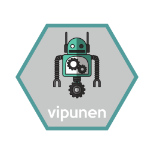

[](https://www.tidyverse.org/lifecycle/#experimental)
[](https://travis-ci.org/rOpenGov/vipunen)
[](https://ci.appveyor.com/project/rOpenGov/vipunen)
[](https://codecov.io/github/rOpenGov/vipunen?branch=master)

# vipunen



`vipunen` is a client package for [Vipunen](https://vipunen.fi/en-gb/), the 
education administration's reporting portal. The Ministry of Education and 
Culture and the Finnish National Agency for Education are jointly responsible for 
the content on Vipunen, but have nothing to do with this R package.

Statistical data from Vipunen is also machine readable through a REST/JSON API.
The API was opened in August 2017 and is currently still in development phase.
In this first phase, the content is moslty related to the data collected from 
universities.

For further details about the API (in Finnish only), please see:

https://vipunen.fi/fi-fi/Sivut/Vipunen-API

## Installation

`vipunen` is not yet on CRAN, but you can install it from GitHub with:

``` r
install.packages("remotes")
remotes::install_github("ropengov/vipunen")
```

## Example

This is a basic example which shows you how to solve a common problem:

``` r
## basic example code
```

