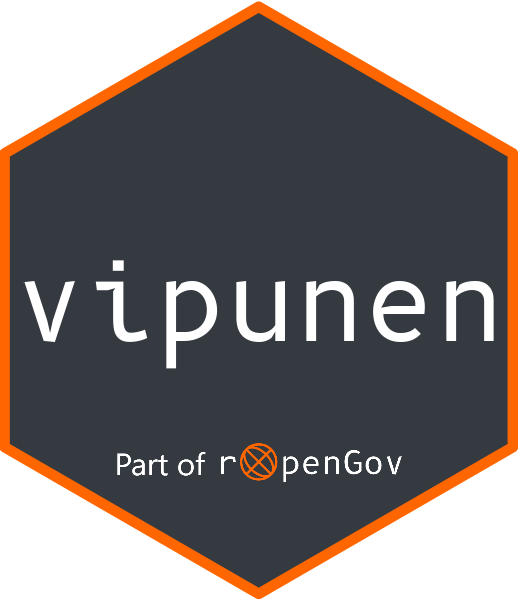

<!-- badges: start -->

[](http://ropengov.org/)
[](https://www.tidyverse.org/lifecycle/#experimental)
[](https://github.com/rOpenGov/vipunen/actions)
[](https://codecov.io/github/rOpenGov/vipunen?branch=master)
<!-- badges: end -->


# vipunen <a href='https://ropengov.github.io/vipunen/'></a>

`vipunen` is a client package for [Vipunen](https://vipunen.fi/en-gb/), the 
education administration's reporting portal. The Ministry of Education and 
Culture and the Finnish National Agency for Education are jointly responsible for 
the content on Vipunen, but have nothing to do with this R package.

Statistical data from Vipunen is also machine readable through a REST/JSON API.
The API was opened in August 2017 and is currently still in development phase.
In this first phase, the content is moslty related to the data collected from 
universities.

To cite package ‘vipunen’ in publications use:

  Lehtomäki J, Tolvanen A (2024). _vipunen: Client Package for Vipunen API_. R package version
  0.1.1.9000, https://ropengov.github.io/vipunen/, https://github.com/rOpenGov/vipunen,
  <https://ropengov.github.io/vipunen>.

A BibTeX entry for LaTeX users is

  @Manual{,
    title = {vipunen: Client Package for Vipunen API},
    author = {Joona Lehtomäki and Arvi Tolvanen},
    year = {2024},
    note = {R package version 0.1.1.9000, 
https://ropengov.github.io/vipunen/,
https://github.com/rOpenGov/vipunen},
    url = {https://ropengov.github.io/vipunen},
  }


All data available through the API is licensed under [Creative Commons Attribution 4.0 (CC BY 4.0)](https://creativecommons.org/licenses/by/4.0/). To cite the data, please use the following format:  

(in Finnish)  
Vipunen - opetushallinnon tilastopalvelu: Raportin nimi. Tietolähde. Saantitapa: Vipunen-rajapinta \[Viitattu pvm\]

(in English)  
Vipunen - Educational Statistics Finland: Report name. Source. Acquired from: Vipunen API \[Date cited\]  


For further details about the API (in Finnish only), please see:

https://vipunen.fi/fi-fi/Sivut/Vipunen-API

## Installation

`vipunen` is not yet on CRAN, but you can install it from GitHub with:

``` r
install.packages("remotes")
remotes::install_github("ropengov/vipunen")
```

## Example

This is a basic example which shows you how to solve a common problem:

``` r
## basic examples
## get_resource_names()
## get_parameters("koulutusluokitus")
## get_data("koulutusluokitus", limit=10)

```

## Contributors

+ Joona Lehtomäki <joona.lehtomaki@iki.fi>, package maintainer
+ Arvi Tolvanen <arvi.tolvanen@utu.fi>
+ Vilppu Välimäki, logo design
